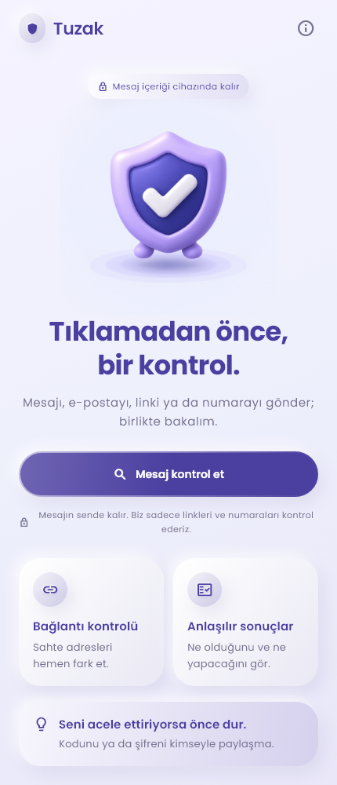
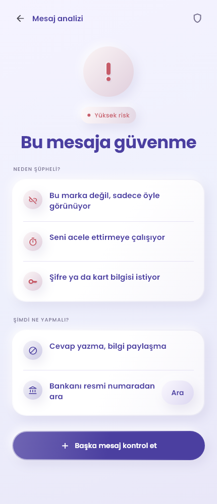

# Tuzak

**Tıklamadan önce, bir kontrol.**

Tuzak; SMS, e-posta veya mesajlaşma uygulamalarından gelen şüpheli metinleri ve
bağlantıları anlaşılır risk işaretlerine dönüştüren, gizlilik odaklı bir Flutter
uygulamasıdır. Kullanıcıya yalnızca bir skor vermek yerine mesajın neden şüpheli
olabileceğini ve sırada ne yapması gerektiğini gösterir.

<p align="center">
  
  &nbsp;&nbsp;
  
</p>

## Neden Tuzak?

- **Sade sonuçlar:** Dört risk seviyesi, kısa gerekçeler ve uygulanabilir öneriler.
- **Gizlilik odaklı:** Mesaj geçmişi tutulmaz; mesajın tamamı bir sunucuya gönderilmez.
- **Yerel analiz:** Türkçe dolandırıcılık kalıpları, marka taklidi ve bağlantı sinyalleri cihazda incelenir.
- **Ek tehdit kontrolü:** Algılanan alan adları, IP adresleri ve telefon numaraları resmi güvenlik servisine ayrı ayrı sorgulanabilir.
- **Paylaşarak kontrol:** iOS paylaşım menüsünden gelen metin, App Group üzerinden geçici olarak uygulamaya aktarılır.
- **Çevrimdışı devam:** Ağ yoksa kullanıcı bilgilendirilir ve mevcut yerel kurallarla analiz sürdürülebilir.

Türkçe arayüz, gömülü Poppins fontu, özel açılış görselleri ve açıklayıcı sonuç
ekranlarıyla uygulama teknik ayrıntıları kullanıcıya yüklemeden yol göstermeyi amaçlar.
Üyelik, uygulamaya ait bir sunucu veya analitik takibi bulunmaz.

**Durum:** Yerel metin ve bağlantı analizi, hazırlanan kural dosyalarıyla çalışır.
Her algılanan bağlantının alan adı/IP adresi ve her telefon numarası resmi tehdit
API'sinde paralel sorgulanır; toplam bekleme dört saniyeyi geçmez. Yalnız gerçek
bağlantı hatası veya zaman aşımında yerel sonuçla devam edilir. İnternet yokken
uygulamanın üstünde bağlantı geri gelene kadar kalıcı bir uyarı gösterilir. Yerel
USOM placeholder hash'leri kullanılmaz; toplu liste
indirme taslağı hâlâ kapalıdır. Başlangıç kuralları gerçek mesajlarla kalibre
edilmemiştir. iOS derleme ve gerçek cihaz doğrulaması bekleniyor.

## Çalıştırma

Flutter 3.44.0 / Dart 3.12.0 ile geliştirilmiştir.

```sh
python tool/sync_analysis_assets.py
flutter pub get
flutter run -d chrome
```

Senkronizasyon varsayılan olarak `../assets/` içindeki hazırlanmış dosyaları alır;
başka konum için `--source PATH` kullanılır. Kural değişikliğinden sonra komutu tekrar
çalıştırıp uygulamayı tamamen durdurarak yeniden başlatın; hot reload, `main()` içindeki
yüklemeyi tekrar çalıştırmaz. Veri dosyaları Git dışında tutulur; yeni klonda ayrıca sağlanmalıdır.

Mobil cihaz için `flutter run`; iOS için macOS/Xcode gerekir. Bundle ID: `com.example.tuzak`.

## Nasıl çalışır?

1. Kullanıcı şüpheli mesajı yapıştırır veya iOS paylaşım menüsünden Tuzak'a gönderir.
2. Yerel motor metin kalıplarını, marka taklidini ve bağlantı özelliklerini inceler.
3. Bulunan host, IP ve telefon numaraları için resmi tehdit kontrolü yapılır.
4. Sonuç; risk seviyesi, en güçlü gerekçeler ve önerilen adımlarla sunulur.

Risk bulunmaması mesajın kesinlikle güvenli olduğu anlamına gelmez. Tuzak, karar
vermeyi kolaylaştıran yardımcı bir kontrol katmanıdır.

## Resmi tehdit API'si

`lib/services/threat_api_service.dart`, Siber Güvenlik Başkanlığı'nın
`GET https://siberguvenlik.gov.tr/api/address/index` adresini kullanır. Anahtar
varsayılan olarak boştur. Yetkilendirme, dört saniye sınırı ve yanıt doğrulama
ayrıntıları:
[API entegrasyonu](docs/threat-api.md).

## Uygulama ikonları

Android ve iOS ikonları `../assets/android` ve `../assets/ios` paketlerinden alınır.
Yenilemek için `python tool/generate_icons.py` çalıştırın (Pillow gerekir; başka
kaynak klasörü için `--source PATH`). Android normal/yuvarlak ve uyarlanabilir
ikonları, iOS ise `AppIcon` kataloğunu kullanır. iOS'ta tamamen opak kaynakların
gereksiz alfa kanalı kaldırılır; görüntü pikselleri değiştirilmez. Yeni ikonlar
hot reload ile yüklenmez; uygulamayı yeniden derleyip cihaza yükleyin.

Ekran görselleri `assets/ımage/` altındadır: `splash.png` açılışta, `open.png`
ana ekranda, `serch.png` mesaj kontrol ekranında kullanılır. Splash gösterilirken
kurallar yüklenir; yaklaşık 1,6 saniye sonra hazır olduğunda ana ekrana geçilir.
iOS paylaşımı bekliyorsa kontrol ekranı otomatik açılır. iOS native launch ekranı
aynı splash görselini, Android'in sistem açılışı siyah zemin ve uygulama ikonunu kullanır.

## Tipografi

Tüm ekranların yazı stilleri `lib/core/theme/app_theme.dart` içindeki
`GoogleFonts.poppinsTextTheme()` üzerinden yönetilir. Başlıklar 600/700,
gövde 400, küçük etiketler 500 ağırlığını kullanır. Font indirme çalışma anında
kapalıdır (`GoogleFonts.config.allowRuntimeFetching = false`).

`assets/fonts/poppins/` içindeki Regular, Medium, SemiBold ve Bold dosyaları hem
asset hem `fonts:` kaydı olarak paketlenir; ilk açılış için internet gerekmez.
Yeni ağırlık eklenirse ilgili statik TTF dosyasını bu klasöre koyup `pubspec.yaml`
içindeki font ağırlığı kaydını da güncelleyin. Kaynak:
[Google Fonts Poppins](https://github.com/google/fonts/tree/main/ofl/poppins);
SIL Open Font License aynı klasördeki `OFL.txt` dosyasındadır.

## Doğrulama

```sh
python tool/sync_analysis_assets.py --check
flutter analyze
flutter test
flutter build web --release --no-web-resources-cdn
```

## Yapı

`lib/core`: tema ve ortak bileşenler · `lib/features/analysis`: motor, veri ve ekranlar · `lib/features/sharing`: iOS köprüsü · `lib/l10n`: çeviriler.

[Veri sözleşmesi](docs/rule-format.md) · [iOS kurulumu](docs/ios-setup.md)

Özel kurallar, gerçek mesaj/test verileri, `.env`, imzalama dosyaları ve yerel ayarlar `.gitignore` ile dışarıda tutulur. Depoda yalnızca boş veri şablonları ve sentetik testler bulunur. Mesaj içeriği, bağlantı yolu ve sorgu parametreleri gönderilmez; yalnız bağlantı hostları ve telefon numaraları resmi güvenlik servisine sorgulanır. Risk bulunmaması güvenlik garantisi değildir.
